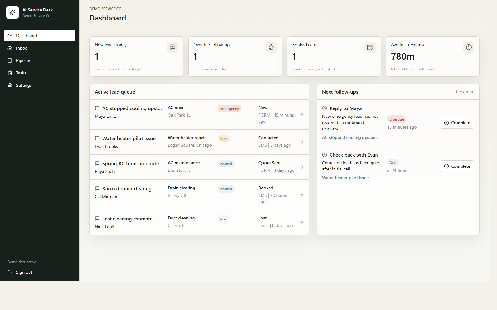

# AI Service Desk

AI Service Desk is an AI-assisted service desk MVP for small home-service businesses.

It captures inbound leads from web forms and SMS, turns raw conversations into structured records, suggests the first reply, tracks pipeline state, and creates follow-up tasks when leads go stale. The product is intentionally narrow: intake, response, tracking, and follow-up instead of a broad "AI for everything" platform.

## Preview



## What This Repo Demonstrates

- Web and SMS lead intake in a single operator workflow
- Structured AI extraction and summary generation
- Suggested first replies for inbound conversations
- Multi-screen operator UI for dashboard, inbox, lead detail, tasks, pipeline, and settings
- Follow-up automation for stale leads
- Demo-first local development with no required backend to view the app shell

## Why This Maps To Digital Forms And Workflow Work

- The intake layer is schema-validated with typed request handling instead of trusting raw client payloads.
- The product is organized around form and message workflows: capture, normalize, review, respond, track, and follow up.
- External integrations stay narrow and operational: Supabase for auth/data, Twilio for inbound SMS, and OpenAI for constrained enrichment.
- The operator UI is built in React and Next.js around the exact work an internal team would need to review submissions and resolve issues.

## 60-Second Demo

1. Install dependencies:

```powershell
npm ci
```

2. Start the app:

```powershell
npm run dev
```

3. Open `http://localhost:3000`.
4. The app redirects to `/dashboard`.
5. If Supabase environment variables are not set, the app runs in demo mode with built-in workspace data so you can review the product surface immediately.

## Stack

- Next.js App Router
- TypeScript
- Tailwind CSS
- Supabase Auth, Postgres, and RLS
- OpenAI Responses API with Structured Outputs
- Twilio inbound SMS webhook

## Core Workflow

1. Capture a lead from a public form or inbound SMS.
2. Normalize the lead into structured fields and a readable summary.
3. Route the lead into the operator inbox and pipeline.
4. Review the lead detail page, message history, notes, and AI reply suggestion.
5. Track stale work and generate follow-up tasks automatically.

## Demo Mode

If Supabase environment variables are missing, the app renders the operator console with built-in demo data. This makes the repo easy to review without provisioning a database first.

API routes that write or synchronize real data still require backend credentials.

## Local Setup With Supabase

1. Install Node.js 20.9+.
2. Copy `.env.example` to `.env.local` and fill in Supabase, OpenAI, and Twilio values.
3. Start Supabase locally or create a hosted Supabase project.
4. Run the SQL in `supabase/migrations/001_initial_schema.sql`.
5. Run `supabase/seed.sql` for starter data.
6. Install and run:

```powershell
npm ci
npm run dev
```

## Verification

Use [docs/test-plan.md](docs/test-plan.md) for the smoke checklist, API verification matrix, and live-stack walkthrough.

For the standard repo validation pass, run:

```powershell
npm run check
```

For a Windows-safe local validation helper after dependencies are installed, run:

```powershell
powershell -NoProfile -ExecutionPolicy Bypass -File .\scripts\check-local.ps1
```

## Required Endpoints

- `POST /api/leads/form`
- `POST /api/twilio/inbound`
- `POST /api/ai/summarize`
- `POST /api/ai/suggest-reply`
- `POST /api/tasks/run-followups`

## Example Web Form Payload

```json
{
  "business_slug": "demo-service-co",
  "contact_name": "Maya Ortiz",
  "phone": "+13125550144",
  "email": "maya@example.com",
  "location_text": "Oak Park, IL",
  "service_requested": "AC repair",
  "message": "The upstairs AC stopped cooling and we need help today.",
  "preferred_contact_method": "sms"
}
```

## Twilio Setup

Save the Twilio business number in Settings, then configure your Twilio Messaging webhook to `POST` to:

```text
https://your-domain.com/api/twilio/inbound
```

Recommended environment values for a real deployment:

- `NEXT_PUBLIC_APP_URL`: public base URL used to generate the webhook URL shown in Settings
- `TWILIO_AUTH_TOKEN`: enables Twilio signature validation on inbound requests
- `TWILIO_WEBHOOK_URL`: optional exact override when Twilio reaches the app through a different public URL

The route expects `application/x-www-form-urlencoded`, maps inbound SMS to a business through the saved Twilio number, validates the Twilio request signature when `TWILIO_AUTH_TOKEN` is set, and returns valid TwiML.

## Follow-Up Job

For local testing:

```powershell
curl -X POST http://localhost:3000/api/tasks/run-followups -H "x-cron-secret: $env:CRON_SECRET"
```

In production, call the same route from Supabase Cron, a scheduled Edge Function, or Vercel Cron. Keep `CRON_SECRET` set.

## Troubleshooting

This repo defaults to `webpack` in local development because Turbopack is currently unstable on this Windows setup.

This repo expects Node.js to be installed locally. Local-only tool folders are intentionally ignored.
